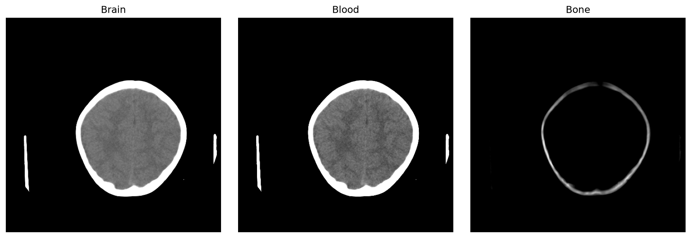
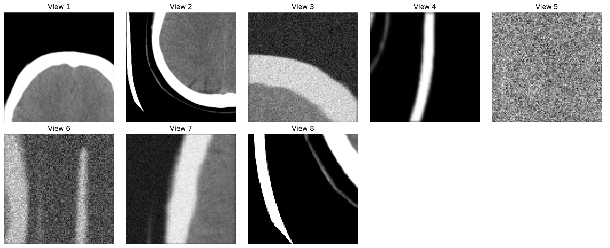
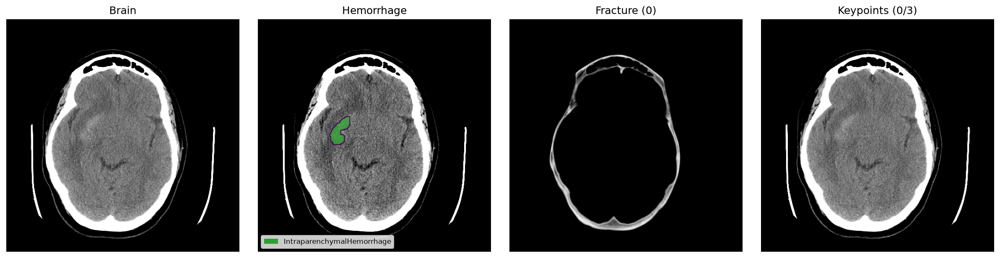
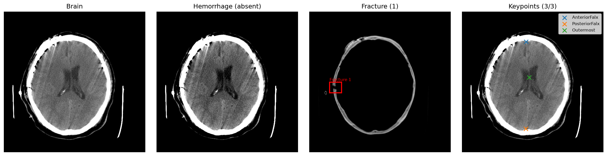
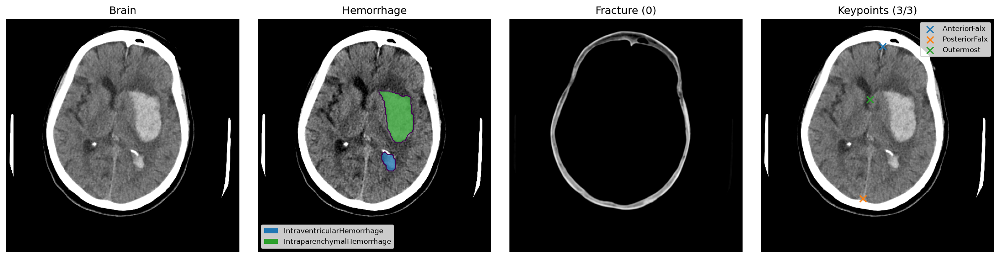

# Brain CT Triage

A PyTorch/MONAI pipeline for the IAAA Brain CT Triage Challenge. The project
analyzes non-contrast brain CT series and predicts seven clinically meaningful
quantities:

- hemorrhage volume for EDH, SDH, IPH, SAH, and IVH (mL);
- probability of any skull fracture;
- midline shift (mm).

The challenge's fixed clinical rule converts these predictions into one of
three triage classes: **non-urgent**, **urgent**, or **critical**.

## Approach

Training has three stages:

1. **DINO pretraining** learns a CT representation from unlabelled slices.
2. **Linear probing** evaluates the frozen DINO backbone with five-fold cross-validation.
3. **Multitask training** fine-tunes the backbone for hemorrhage segmentation,
   fracture detection, and midline keypoint localization.

During inference, slice-level predictions are combined into study-level
hemorrhage volumes, fracture probability, and midline shift.

## Project structure

```text
configs/                 Dataset, model, training, and runtime settings
scripts/                 Metadata preparation and training entry points
src/                     Data pipeline, models, training, and inference code
artifacts/
|-- figures/             Project visualizations used below
|-- tensorboard/         TensorBoard event logs
|-- checkpoints/         Lightning checkpoints
`-- weights/             Exported model weights
model.py                 Competition Model API
submission.py            Dataset inference CLI
```

## Setup

Python 3.12 and a CUDA-capable GPU are recommended.

```powershell
python -m venv .venv
.venv\Scripts\Activate.ps1
python -m pip install --upgrade pip
pip install -e .
```

For notebooks and development tools:

```powershell
pip install -e ".[notebooks,dev]"
```

## Data

Set the dataset paths in `configs/data/paths.yaml`. The default layout is:

```text
data/
|-- training_df.pkl
|-- train/
|   |-- dicoms/
|   `-- annotations/
`-- predict/
    `-- dicoms/
```

Prepare and validate the metadata CSV files with:

```powershell
python scripts/prepare_metadata.py
```

## Training

Run the stages from the repository root:

```powershell
python scripts/train_dino.py
python scripts/train_probe.py
python scripts/train_multitask.py
```

The probe and multitask scripts run all configured cross-validation folds.
Training parameters such as epochs, precision, batch-size search, optimizer,
and checkpointing are defined in `configs/training/`.

## TensorBoard logs

Training automatically writes event files to `artifacts/tensorboard`. Start
TensorBoard from the project root:

```powershell
tensorboard --logdir artifacts/tensorboard --port 6006
```

Open <http://localhost:6006> in a browser. The runs are grouped as:

- `dino/version_*` for self-supervised pretraining;
- `probe/fold_*/version_*` for linear-probe folds;
- `multitask/fold_*/version_*` for supervised multitask folds.

Use the **Scalars** page to compare training and validation losses, learning
rate, task metrics, and fold performance. Select or hide runs in the left
panel, and use smoothing only for visualization—the unsmoothed values remain
the source of truth. Each new execution creates another `version_*` directory,
so previous runs are preserved.

## Inference

Place the exported multitask weights at the path configured under
`artifacts.weights` (by default
`artifacts/weights/multitask/best_model.pt`), then run:

```powershell
python submission.py `
  --data-dir path/to/dicom-series-root `
  --predictions-file-path submission.csv
```

The data directory must contain one subdirectory per CT series. The generated
CSV contains `series_id` and the seven required intermediate predictions.

## Figures

### CT windows

Brain, blood, and bone windows used by the input pipeline.



### DINO augmented views

Example global and local views used for self-supervised pretraining.



### Multitask annotations

Hemorrhage segmentation example:



Fracture box and midline keypoints:



Hemorrhage masks and complete midline keypoints:



## Tests

```powershell
python -m pytest
```

> This project is for challenge research and is not a clinical diagnostic tool.
